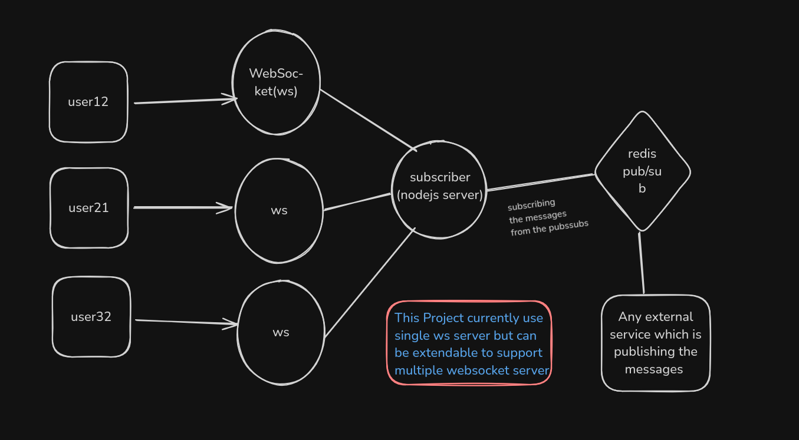

# Realtime WS Notifier

A lightweight WebSocket server using Redis Pub/Sub to deliver real-time events to connected users, based on their `userId`.

## 📦 Tech Stack

- TypeScript
- Node.js
- WebSocket (ws)
- Redis (Pub/Sub)

### 🧠 Project Architecture



## 🧠 How It Works

1. **Client Connects**: A browser (or any WebSocket client) connects and sends their `userId` as the first message.
2. **WebSocket Server**: The server stores the client connection mapped by `userId`.
3. **Redis Pub/Sub**: 
    - Redis subscribes to a `user-event` channel.
    - Any service (like an Express app or another backend process) can publish to that channel with a payload like:
      ```json
      {
        "userId": "123",
        "event": "NEW_MESSAGE",
        "data": {
          "message": "Hello from Redis!"
        }
      }
      ```
    - The WebSocket server listens for Redis messages and sends them to the correct user if they are connected.

## New Features Added

1. **Multi Device Logic**
  - `DEVICE_POLICY=all` (default): all active sockets for a user receive events.
  - `DEVICE_POLICY=latest`: newest connection closes previous sockets for that user.

2. **Rate Limiting + Backpressure**
  - Per user send rate limit using `MAX_RATE` (messages per interval).
  - Overflow messages go to a bounded in-memory queue (`MAX_QUEUE`).
  - If queue is full , oldest queued message is dropped.

3. **Offline Delivery (Pending Events)**
  - If user has no active socket , message is stored in Redis list.
  - On reconnect , pending messages are fetched and sent to the user.
  - Pending key expires automatically after `PENDING_SECONDS` seconds.

## ⚠️ Important Note: Redis & WebSocket Must Share Memory

For **basic local testing**, the WebSocket server (`websocket.ts`) and Redis subscriber (`redis.ts`) must run in the **same Node.js process**, because the WebSocket connections are stored in memory (RAM). If you run them in different terminals, Redis will not be able to access the sockets.


## 🚀 How to Run 

### 1. Start Redis Server

Make sure Redis server is running on your system and also redis should be running locally.

### 🐳 How to Run Redis Locally and Use It as a DB

You can use Docker to quickly start a Redis instance locally:

```bash
### Start Redis container
docker run --name my-redis -d -p 6379:6379 redis

### Connect to the running Redis container
docker exec -it my-redis /bin/bash

### Access Redis CLI inside the container
redis-cli
```

 ```bash 
 #### Or to use directly deployed redis url then use the following command

  redis-cli -u <redis-env-var>
  ##### publishing event by being an external service 
  PUBLISH user-event '{"userId":"123","event":"NEW_MESSAGE","data":{"message":"Hello from Abhishek"}}'


### 2. Start the WebSocket Server
```bash
ts-node src/index.ts (this would run both websocket and redis in the same process so they can share memory(userId))
